# Intro to ASG (auto scaling groups)

ASG is a solution for dealing with CPU load going too high. Not dealing with it efficantly will make our website crash, ASG deals with it automatically. There are more ways too deal with too much load on our VMs, but ASG is so far the best.


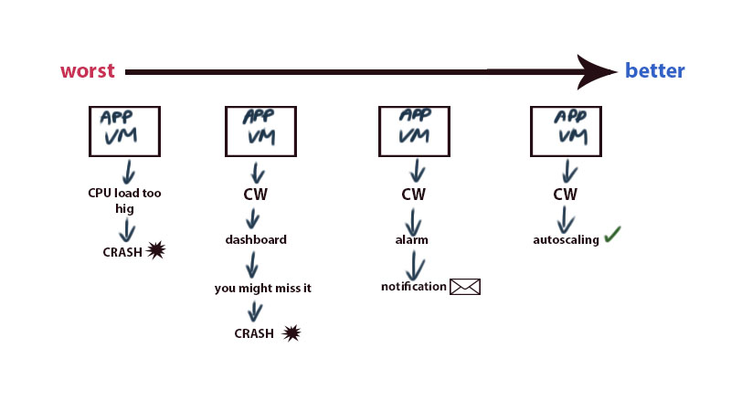

Benefits
- High availability - multiple EC2 instances in different data centers in that region. A region will usually have 3 availability zones
- Scaling
  - out/in - more instances of VMs are created
  - up/down - getting moved to another VM that's bigger


<br />

## From VM to ASG

1. Create **VM** with **User Data**
2. Create **AMI** from that **VM**
3. Create **Launch Template** from that **AMI**, adding **User Data** with only commands to run the scrip, not to download data. The data has already been downloaded by AMI, to make our LT run faster, we omit scripts downloading data again.
4. Create **ASG** using the **Launch Template**
5. **Scaling Policy** is added/created while creating ASG. It defines when ASG needs to create more instances. For example:
      1. **CPU: 50%**       - create a new instance if average CPU load is 50% and up
      2. **min: 2**         - minimum amount of VMs
      3. **desired: 2**     - desired amount of VMs
      4. **max: 3**         - maximum amount of VMs


<br />

### Creating Launch Template

1. "Instances" -> "Launch Templates"
   
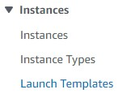

2. Add the AMI we want to creat the Launch Template from
   
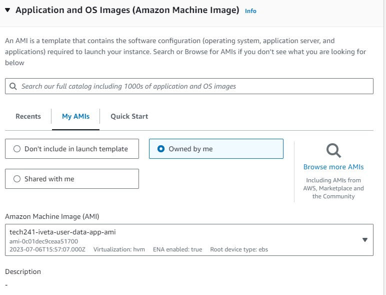


3. Adding **User Data** with only commands to run the scrip, not to download data. The data has already been downloaded by AMI, to make our LT run faster, we omit scripts downloading data again.
   
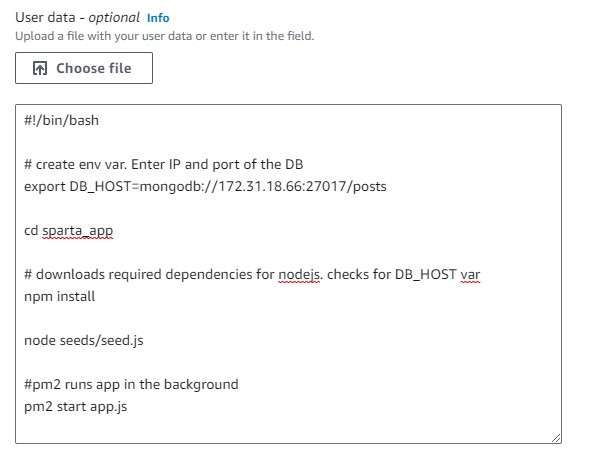


<br />

### Creating ASG

1. "Auto Scaling" -> "Auto Scaling Groups"
   
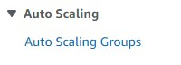

2. Choose the template to make ASG from


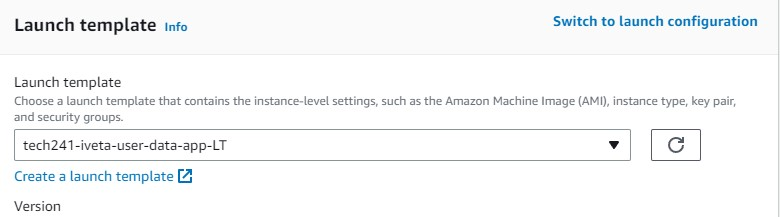


3. Select **Availability Zones** for **high availability**


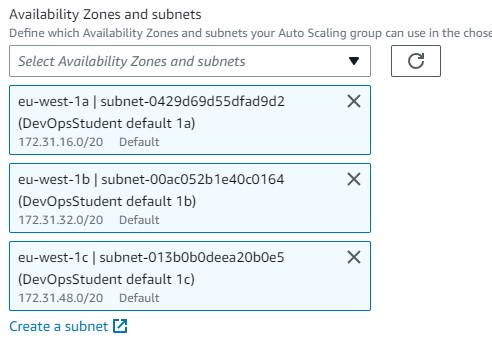


4. Create **Load Balancer**


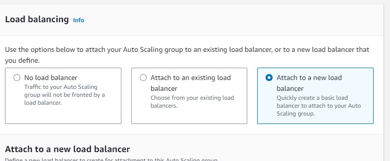

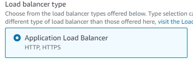

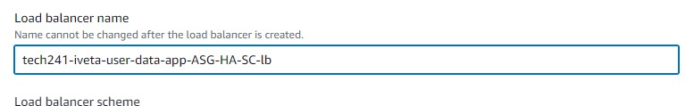


1. Create **Target Group** (our VM instances are in it)
   
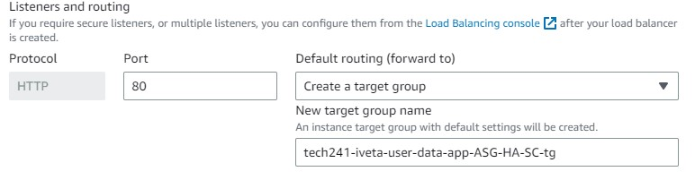


6. Select desired, minimum, maximum amount of VMs
   
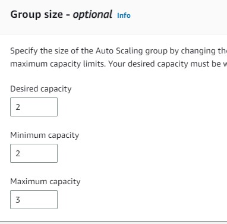

7. Pick CPU load value

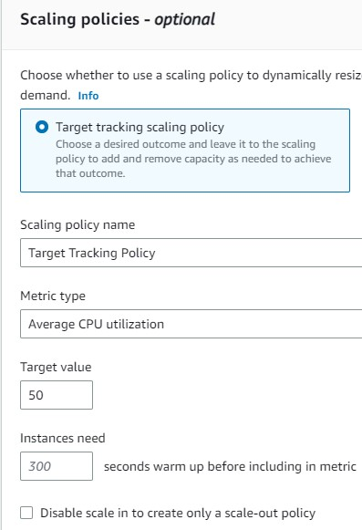


```
 export DB_HOST=mongodb://111.222.333.444:27017/posts 
 ```

