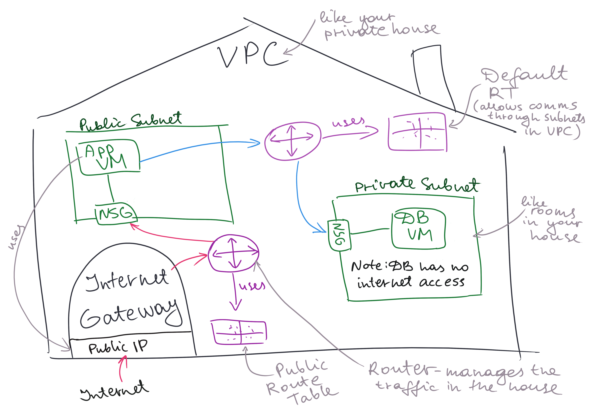

# Intro to VPC (Pirtual Private Cloud)

Using Virtual Public Cloud allows everyone in that VNet to access your data. That is not secure. To make it secure we use Private Cloud.

In pur VPC, we can manage who can access which subnets.

