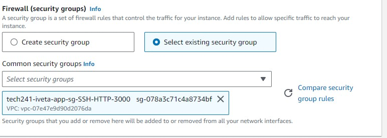
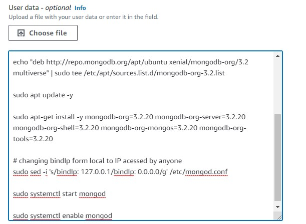
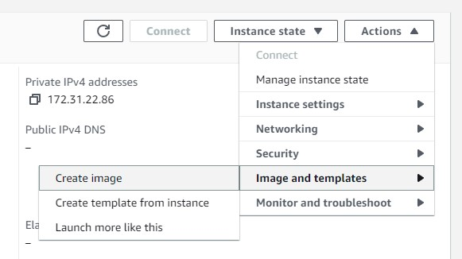
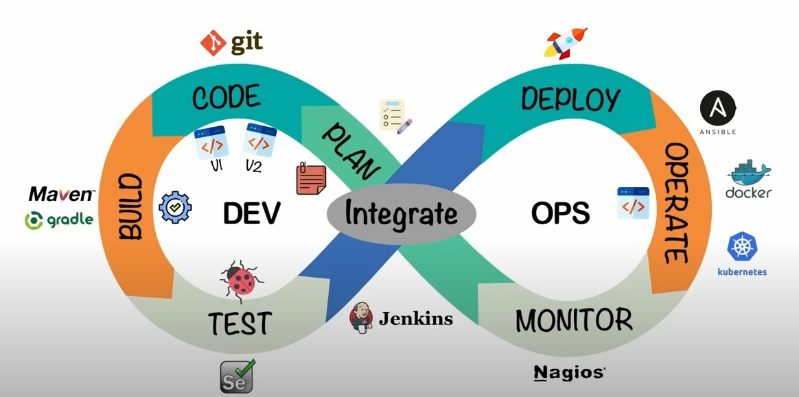

# Intro to AWS

### What is AWS?

Amazon Web Services, Inc. is a subsidiary of Amazon that provides on-demand cloud computing platforms and APIs to individuals, companies, and governments, on a metered, pay-as-you-go basis.

### Azure vs AWS

- Recource groups
    - In Azure, everything goes in recource groups. 
    - In AWS, they are not necessary.
- IP addresses 
    - Azure, by default, uses static
    - AWS, by default, uses dynamic
- Terminology
    - Private key key.pem
    - Launch vs create VM
    - Delete vs terminate VM
    - SHH key vs key pairs

### Creating EC2 (VM)

1. Changing to appropriate region

2. Getting the private key and selecting existing key pair

3. Selecting correct image 

4. Security group
   
After creating it once, we can re-use it

5. Stop instance to stop the VM, terminate instance to deleted the VM

### Automating Sparta app using AWS

Key difference: IP address is now dynamic. The IP will have to be changed with every launch, we use **private IP** so we have a static IP address

#### User Data

We paste our working and tested script into User Image so that VM runs it automatically. This is done while creating a VM in Advanced details -> User data

### Creating AMI

AMI - amazon machine image. Stores reference to the snapshot of the VM disk (maiking a copy of a VM).

1. Have a VM we want to create AMI from
2. Create AMI by Actions -> Image and templates -> Create image

3. Create exact copy of VM using the AMI by clicking Launch instannce from AMI

### What is DevOps?

DevOps focuses on communication between development and operations team to get a viable product for business quickly and efficiently. The processes are automated to make the life cycle of product release as smooth and quick as possible for the end users. DevOps brings together the skills, processes, and tools together from both development and operations teams to bridge the gap between them.

#### Benefits of DevOps

There are three primary categories of benefits for DevOps: technical benefits, cultural benefits, and business benefits. The technical benefits include reduced complexity, continuous delivery, and faster problem resolution. DevOps practitioners typically deploy higher-quality code faster than traditional siloed teams.

The cultural benefits are more productive and efficient teams, and happier customers. On the business end, the benefits include greater collaboration and trust between team members, which results in faster delivery and stable operating environments.

