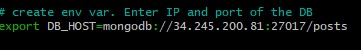

# Intro to AWS

### What is AWS?

Amazon Web Services, Inc. is a subsidiary of Amazon that provides on-demand cloud computing platforms and APIs to individuals, companies, and governments, on a metered, pay-as-you-go basis.

### Azure vs AWS

- Recource groups
    - In Azure, everything goes in recource groups. 
    - In AWS, they are not necessary.
- IP addresses 
    - Azure, by default, uses static
    - AWS, by default, uses dynamic
- Terminology
    - Private key key.pem
    - Launch vs create VM
    - Delete vs terminate VM
    - SHH key vs key pairs

### Creating EC2 (VM)

1. Changing to appropriate region

2. Getting the private key and selecting existing key pair

3. Selecting correct image 

4. Security group
   
After creating it once, we can re-use it

5. Stop instance to stop the VM, terminate instance to deleted the VM

### Automating Sparta app using AWS

Key difference: IP address is now dynamic. The IP will have to be changed with every launch.

